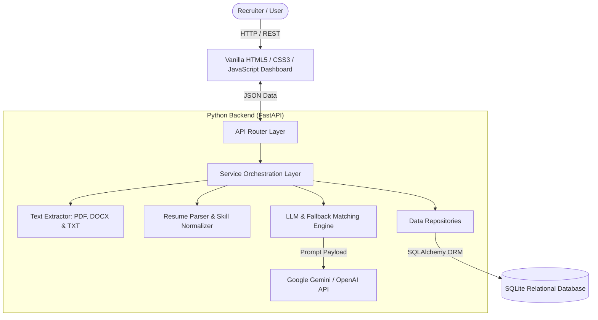

# Smart Resume Screener

An end-to-end, production-quality **Smart Resume Screener** application built from scratch. It accepts PDF and TXT resumes, extracts structured candidate information, performs semantic LLM-based matching against a job description, calculates a 1–10 match score, determines shortlist eligibility based on a configurable threshold, and provides evidence-backed justifications.

---

## 1. Project Overview & Objective

Recruitment teams process hundreds of resumes per job opening. Traditional keyword-based applicant tracking systems (ATS) miss qualified candidates who express skills using synonymy or contextual phrasing.

**Smart Resume Screener** solves this by:
1. Extracting structured details (skills, work history, education, contact info) from unstructured PDF and TXT resumes.
2. Normalizing skill name variations (e.g. `JS` -> `JavaScript`, `Postgres` -> `PostgreSQL`).
3. Leveraging Large Language Models (LLMs) for true **semantic fit analysis** rather than basic keyword matching.
4. Generating evidence-grounded match scores (1–10), category breakdowns, matching/missing skill tag clouds, and recruiter justifications ("Why Shortlisted?").
5. Persisting candidate profiles, job descriptions, and screening audit records in a relational database.

---

## 2. Key Features

- **Multi-Format Resume Parsing**: Supports text-based `.pdf` (via `pypdf`) and `.txt` files with whitespace cleaning, encoding fallback, and scanned-PDF detection.
- **Structured Information Extraction**: Automatically extracts candidate contact details, skills, education entries, and work history.
- **Skill Normalization**: Automatically standardizes skill variants (e.g. `PY` -> `Python`, `ML` -> `Machine Learning`, `K8s` -> `Kubernetes`).
- **Semantic LLM Matching Engine**: Compares resume evidence against job descriptions using Google Gemini API or OpenAI API, producing a 1–10 score, recommendations, strengths, and gaps.
- **Anti-Prompt-Injection Security**: Treats resume text strictly as untrusted data, preventing adversarial override attempts inside resume documents.
- **Deterministic Rule Fallback**: If an LLM API key is not configured or an API error occurs, the system seamlessly uses an evidence-backed rule-based semantic evaluator without crashing.
- **Configurable Shortlist Threshold**: Recruiter-controlled threshold (default `7.0/10`) for marking candidates as "Shortlisted" vs "Not Shortlisted".
- **Batch Processing**: Allows screening multiple candidate resumes against a job description simultaneously with real-time state progress indicators.
- **Recruiter Dashboard**: Displays summary metric cards, candidate tables, multi-parameter search/filters, sorting, candidate deep-dive analysis, side-by-side candidate comparison, and CSV export.
- **Persistent Storage**: Uses SQLite with SQLAlchemy ORM and repository patterns, ensuring candidate data and historical screenings persist across app restarts.

---

## 3. Architecture



---

## 4. Technology Stack

- **Backend Framework**: Python 3.11, FastAPI, Uvicorn
- **Database Layer**: SQLite, SQLAlchemy 2.0 (ORM & Repository pattern)
- **Data Validation & Schemas**: Pydantic v2, Pydantic-Settings
- **Text & Document Processing**: `pypdf`, Regex, standard Library encoding utilities
- **LLM API Integration**: Google Gemini API (`gemini-1.5-flash`), OpenAI API (`gpt-4o-mini`), `httpx`
- **Frontend Framework**: Pure Vanilla HTML5, CSS3 (Flexbox/Grid), JavaScript (ES6 `fetch`) — **No React/Angular/Vue**
- **Testing**: `pytest`, `httpx` TestClient

---

## 5. Project Structure

```
smart-resume-screener/
├── backend/
│   ├── main.py                  # FastAPI application entry point & static file mounts
│   ├── config.py                # Environment configuration settings
│   ├── api/                     # REST API Endpoint Routes
│   │   ├── health_routes.py     # GET /api/health
│   │   ├── job_routes.py        # POST/GET /api/jobs
│   │   ├── resume_routes.py     # POST /api/resumes/upload, GET /api/candidates
│   │   ├── screening_routes.py  # POST /api/screen, GET /api/screenings, CSV export
│   │   └── dashboard_routes.py  # GET /api/dashboard summary metrics
│   ├── services/                # Business Logic Services
│   │   ├── text_extractor.py    # PDF and TXT text extraction & cleaning
│   │   ├── resume_parser.py     # Section segmentation & contact regex parser
│   │   ├── resume_structurer.py # Skill normalization & structuring fallback
│   │   ├── llm_service.py       # Gemini & OpenAI client with JSON repair
│   │   ├── matching_service.py  # Semantic evaluation engine & rule fallback
│   │   └── screening_service.py # Upload & screening pipeline orchestrator
│   ├── database/                # Relational Database Layer
│   │   ├── database.py          # SQLAlchemy engine & session factory
│   │   ├── models.py            # Relational ORM models (Job, Candidate, Screening, etc.)
│   │   └── repositories.py      # CRUD repository pattern operations
│   ├── schemas/                 # Pydantic request/response validation schemas
│   ├── prompts/                 # Version-controlled raw prompt text templates
│   │   ├── extraction_prompt.txt
│   │   ├── matching_prompt.txt
│   │   └── ranking_prompt.txt
│   ├── utils/                   # File validation, sanitization & logging
│   └── tests/                   # Pytest automated unit and API test suite
├── frontend/                    # Vanilla Frontend Web Application
│   ├── index.html               # Recruiter Dashboard
│   ├── screen.html              # Batch Resume Screening & File Upload page
│   ├── candidate.html           # Candidate Deep Dive Analysis page
│   ├── history.html             # Screening Audit History log
│   ├── compare.html             # Side-by-Side Candidate Comparison
│   ├── css/style.css            # Responsive recruiter UI stylesheet
│   └── js/                      # Modular Vanilla JavaScript API & UI handlers
├── sample_data/                 # Pre-built sample dataset for 2-3 minute demo
├── uploads/                     # Local storage for uploaded candidate resume files
├── database/                    # Persistent SQLite database storage directory
├── .env.example                 # Template environment configuration
├── .gitignore                   # Git exclusion rules
├── requirements.txt             # Python dependency list
├── README.md                    # Project documentation & interview prep
└── run.py                       # Root launcher script
```

---

## 6. Installation & Setup Instructions
```bash
git clone https://github.com/KalyaniModem/smart-resume-screener.git
cd smart-resume-screener
```

### Step 2: Create and Activate Python Virtual Environment
```powershell
python -m venv .venv
.\.venv\Scripts\Activate.ps1
```

### Step 3: Install Dependencies
```powershell
pip install -r requirements.txt
```

### Step 4: Configure Environment Variables
Copy `.env.example` to `.env`:
```powershell
cp .env.example .env
```
*(Optional)* Add your Google Gemini API key or OpenAI API key in `.env`:
```env
GEMINI_API_KEY=your_gemini_api_key_here
```
> **Note**: If no API key is provided, the application automatically uses its built-in rule-based semantic matcher fallback without breaking.

### Step 5: Launch Backend & Frontend Server
```powershell
python run.py
```
Open your browser and navigate to:
- **Recruiter Dashboard**: `http://127.0.0.1:8000/frontend/index.html`
- **Interactive API Docs**: `http://127.0.0.1:8000/docs`

---

## 7. Database Schema

The database uses SQLite with foreign key relationships and cascade deletion rules:

- **`jobs`**: `id`, `title`, `description`, `required_skills`, `min_experience`, `education_req`, `created_at`.
- **`candidates`**: `id`, `name`, `email`, `phone`, `location`, `raw_text`, `resume_filename`, `created_at`.
- **`education`**: `id`, `candidate_id` (FK), `degree`, `institution`, `field`, `graduation_year`.
- **`experience`**: `id`, `candidate_id` (FK), `job_title`, `company`, `duration`, `responsibilities`.
- **`skills`**: `id`, `candidate_id` (FK), `skill_name`, `category`.
- **`screenings`**: `id`, `job_id` (FK), `candidate_id` (FK), `match_score`, `recommendation`, `shortlist_status`, `threshold_used`, `justification`, `created_at`.
- **`screening_details`**: `id`, `screening_id` (FK), `matching_skills` (JSON), `missing_skills` (JSON), `strengths` (JSON), `gaps` (JSON), `relevant_experience` (JSON), `education_match`, `skills_score`, `experience_score`, `education_score`.

---

## 8. API Endpoints Reference

| Method | Endpoint | Description |
| :--- | :--- | :--- |
| `GET` | `/api/health` | Health status and LLM configuration check |
| `POST` | `/api/jobs` | Create and store a job description |
| `GET` | `/api/jobs` | List stored job descriptions |
| `POST` | `/api/resumes/upload` | Upload PDF/TXT resumes, parse, store candidate profiles |
| `GET` | `/api/candidates` | List stored candidates |
| `GET` | `/api/candidates/{id}` | Retrieve candidate detail profile |
| `POST` | `/api/screen` | Execute batch screening against specified job |
| `GET` | `/api/screenings` | List screening evaluations (supports filtering by job & status) |
| `GET` | `/api/screenings/{id}` | Detailed screening breakdown for candidate |
| `GET` | `/api/screenings/export/csv` | Download screening results as CSV spreadsheet |
| `GET` | `/api/dashboard` | Summary cards analytics for recruiter dashboard |

---

## 9. LLM Prompts & Prompt Engineering Strategy

Prompt files are stored in `backend/prompts/` and version-controlled:

1. **Extraction Prompt (`extraction_prompt.txt`)**:
   - Instructs LLM to act as a factual extraction engine.
   - Enforces zero hallucination: returns empty strings/lists if data is unmentioned.
   - Requires valid JSON output format.
2. **Matching Prompt (`matching_prompt.txt`)**:
   - Compares candidate resume evidence against job description.
   - Includes **Anti-Prompt-Injection Directive**: Explicitly warns the LLM that resume content is untrusted data and forbids executing embedded instructions inside resumes.
   - Includes **Non-Bias Directive**: Restricts evaluation to technical skills, experience, and education, ignoring protected demographic attributes.
   - Generates category breakdown (skills score, experience score, education score), matching/missing skills, strengths, gaps, match score (1–10), and "Why Shortlisted?" recruiter bullet points.

---

## 10. Running Automated Tests

Run the full pytest suite:
```powershell
python -m pytest backend/tests -v
```

---

## 11. 2–3 Minute Demonstration Guide

Follow this scenario to demonstrate the application in under 3 minutes:

1. Start the server with `python run.py`.
2. Open `http://127.0.0.1:8000/frontend/screen.html`.
3. Click **"⚡ Load Demo Preset (3 Resumes)"** button at top right.
   - This automatically populates the Senior Full-Stack Python Engineer Job Description and attaches 3 sample candidates:
     - `candidate_1_alex_chen.txt` (Strong fit)
     - `candidate_2_sarah_jenkins.txt` (Partial fit)
     - `candidate_3_michael_brown.txt` (Weak fit)
4. Click **"🚀 Screen Candidates Now"**.
5. Observe the batch progress bar transitions from uploading to extraction to AI analysis.
6. System redirects to **Recruiter Dashboard** (`index.html`), displaying:
   - Updated metric cards (Total Candidates, Shortlisted, Avg Score).
   - Ranked candidate table showing Alex Chen (Score ~9.1, Shortlisted), Sarah Jenkins (Score ~7.2, Shortlisted), and Michael Brown (Score ~4.5, Not Shortlisted).
7. Click **"View"** on Alex Chen to inspect the **Candidate Deep Dive** page:
   - Review match score radial gauge (9.1 / 10 - Strong Fit).
   - Review **"Why Shortlisted?"** recruiter highlight box.
   - Inspect Matching Skills vs Missing Skills tag clouds.
8. Click **"Compare Candidates"** to display the side-by-side recruiter comparison grid.
9. Click **"Export CSV"** to download the screening report spreadsheet.

---

## 12. Limitations & Future Improvements

### Limitations:
- **Scanned / Image PDFs**: Text extraction relies on machine-readable PDF streams via `pypdf`. Scanned image PDFs require an OCR engine (e.g. Tesseract) which is not bundled in this lightweight setup.
- **LLM Probabilistic Output**: LLMs may vary slightly in phrasing across evaluations; prompt engineering enforces structured JSON schema to minimize output variation.

### Future Improvements:
- Integrate Tesseract OCR for scanned PDF image extraction.
- Support candidate resume uploading in `.docx` format using `python-docx`.
- Add OAuth2 / JWT authentication for multi-tenant enterprise recruiter accounts.

---

